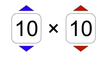

<!---

~~~~~~~~~~~~~
~~ QA Book ~~
~~~~~~~~~~~~~

-->

<h1>QA Book</h1>

This is the QA Book. (QA stands for quality assurance.) If you're reading this, you're probably our new QA tester. If so, welcome! If you're not a PhET employee, 1) thank you for reading this, 2) please let us know how you managed to find this obscure corner of GitHub, and 3) feel free to read on and learn how we test our simulations. Just about everything you need to know to test PhET simulations is in this book.

[Insert cover comic here.]

Thanks to Cornel Stefanache and Constantin Orasanu of MonkeyUser.com for their [humorous comic](https://www.monkeyuser.com/2018/the-struggle/) that Megan "PhETified."

<hr>

<h2>Contents</h2>

**[Section 1: Hardware & Software](https://github.com/phetsims/QA/blob/master/doc/qa-book.md#section-1-hardware--software)**
  - [1.1: Devices](https://github.com/phetsims/QA/blob/master/doc/qa-book.md#11-devices)
  - [1.2: Operating Systems](https://github.com/phetsims/QA/blob/master/doc/qa-book.md#12-operating-systems)
  - [1.3: Web Browsers](https://github.com/phetsims/QA/blob/master/doc/qa-book.md#13-web-browsers)
  - [1.4: Updates](https://github.com/phetsims/QA/blob/master/doc/qa-book.md#14-updates)

**[Section 2: Communication & Coordinization](https://github.com/phetsims/QA/blob/master/doc/qa-book.md#section-2-communication--coordinization)**
  - [2.1: Email](https://github.com/phetsims/QA/blob/master/doc/qa-book.md#21-email)
  - [2.2: Google Groups](https://github.com/phetsims/QA/blob/master/doc/qa-book.md#22-google-groups)
  - [2.3: Google Calendar](https://github.com/phetsims/QA/blob/master/doc/qa-book.md#23-google-calendar)
  - [2.4: Google Drive](https://github.com/phetsims/QA/blob/master/doc/qa-book.md#24-google-drive)
  - [2.5: Slack](https://github.com/phetsims/QA/blob/master/doc/qa-book.md#25-slack)
  - [2.6: Zoom](https://github.com/phetsims/QA/blob/master/doc/qa-book.md#26-zoom)

**[Section 3: GitHub](https://github.com/phetsims/QA/blob/master/doc/qa-book.md#section-3-github)**
  - [3.1: Repositories](https://github.com/phetsims/QA/blob/master/doc/qa-book.md#31-repositories)
  - [3.2: Terminology](https://github.com/phetsims/QA/blob/master/doc/qa-book.md#32-terminology)
  - [3.3: Issues](https://github.com/phetsims/QA/blob/master/doc/qa-book.md#33-issues)

**[Section 4: Testing](https://github.com/phetsims/QA/blob/master/doc/qa-book.md#section-4-testing)**
  - [4.1: Development (Dev) Testing](https://github.com/phetsims/QA/blob/master/doc/qa-book.md#41-development-dev-testing)
  - [4.2: Release Candidate (RC) Testing](https://github.com/phetsims/QA/blob/master/doc/qa-book.md#42-release-candidate-rc-testing)
  - [4.3: PhET-iO Testing](https://github.com/phetsims/QA/blob/master/doc/qa-book.md#43-phet-io-testing)
  - [4.4: Accessibility (a11y) Testing](https://github.com/phetsims/QA/blob/master/doc/qa-book.md#44-accessibility-a11y-testing)
  - [4.5: Online Website Testing](https://github.com/phetsims/QA/blob/master/doc/qa-book.md#45-online-website-testing)
  - [4.6: Offline Website (Installer) Testing](https://github.com/phetsims/QA/blob/master/doc/qa-book.md#46-offline-website-installer-testing)
  - [4.7: Automated (Continuous) Testing](https://github.com/phetsims/QA/blob/master/doc/qa-book.md#47-automated-continuous-testing)
  - [4.8: Memory Leak Testing](https://github.com/phetsims/QA/blob/master/doc/qa-book.md#48-memory-leak-testing)

**[Section 5: Translations](https://github.com/phetsims/QA/blob/master/doc/qa-book.md#section-5-translations)**
  - [5.1: Legacy Simulation Translations](https://github.com/phetsims/QA/blob/master/doc/qa-book.md#51-legacy-simulation-translations)
  - [5.2: HTML5 Simulation Translations](https://github.com/phetsims/QA/blob/master/doc/qa-book.md#52-html5-simulation-translations)
  - [5.3: Website Translations](https://github.com/phetsims/QA/blob/master/doc/qa-book.md#53-website-translations)

**[Section 6: Maintenance & Management](https://github.com/phetsims/QA/blob/master/doc/qa-book.md#section-6-maintenance--management)**
  - [6.1: Testing Matrix Management](https://github.com/phetsims/QA/blob/master/doc/qa-book.md#61-testing-matrix-management)
  - [6.2: PhET Test Maintenance](https://github.com/phetsims/QA/blob/master/doc/qa-book.md#62-phet-test-maintenance)
  - [6.3: Website Administration](https://github.com/phetsims/QA/blob/master/doc/qa-book.md#63-website-administration)
  - [6.4: QA Book Maintenance](https://github.com/phetsims/QA/blob/master/doc/qa-book.md#64-qa-book-maintenance)

<hr>

<!---
\\\\\\\\\\\\\\\\\\\\\\\\\\\\\\\\\\\\\\\\\\\\\\\\\\\\\\\\\\\\\\\\\\\\\\\\\\\\\\\\\\\\\\\\\\\\\\\\\\\\\\\\\\\\\\\\\\\\\\\\
\\\\\\\\\\ Section 1: Hardware & Software
\\\\\\\\\\\\\\\\\\\\\\\\\\\\\\\\\\\\\\\\\\\\\\\\\\\\\\\\\\\\\\\\\\\\\\\\\\\\\\\\\\\\\\\\\\\\\\\\\\\\\\\\\\\\\\\\\\\\\\\\
-->

<h2>Section 1: Hardware & Software</h2>

We like to make sure our sims work on most hardware and most software.

<h3>1.1: Devices</h3>

Check out the [Asset Inventory](link) for a comprehensive list of the devices we own. The "QA Simplified Inventory" is a list of the devices in Ariel's office (F925).

<h3>1.2: Operating Systems</h3>

For a comprehensive list of operating systems we support, check out the [the PhET Help Center](https://phet.colorado.edu/en/help-center/running-sims). (Open the "What are the System Requirements for running PhET simulations?" details.)

<h3>1.3: Web Browsers</h3>

For a comprehensive list of browsers we support, check out the [the PhET Help Center](https://phet.colorado.edu/en/help-center/running-sims). (Open the "What are the System Requirements for running PhET simulations?" details.)


<h3>1.4: Updates</h3>

Never update a testing device unless the QA team lead asks you to do so.

<hr>

<!---
\\\\\\\\\\\\\\\\\\\\\\\\\\\\\\\\\\\\\\\\\\\\\\\\\\\\\\\\\\\\\\\\\\\\\\\\\\\\\\\\\\\\\\\\\\\\\\\\\\\\\\\\\\\\\\\\\\\\\\\\
\\\\\\\\\\ Section 2: Communication & Coordinization
\\\\\\\\\\\\\\\\\\\\\\\\\\\\\\\\\\\\\\\\\\\\\\\\\\\\\\\\\\\\\\\\\\\\\\\\\\\\\\\\\\\\\\\\\\\\\\\\\\\\\\\\\\\\\\\\\\\\\\\\
-->

<h2>Section 2: Communication & Coordinization</h2>

We try to communicate and coordinate effictively at PhET.

<h3>2.1: Email</h3>

Be sure to check your email frequently as PhET employees often communicate their schedules via email. You'll also recieve GitHub notifications via email.

<h3>2.2: Google Groups</h3>

You should be part of the "PhET Team" Google Group.

<h3>2.3: Google Calendar</h3>

Make sure your availability is accurately reflected in the "PhET Student Employees/Researchers" Google Calendar.

<h3>2.4: Google Drive</h3>

We put all sorts of stuff that you'll need to use on Google Drive. You can post videos that you want to use in your issues to Google Drive.

<h3>2.5: Slack</h3>

If you're working, you should be on Slack! Please bother the developers with silly gifs. To do so, type `/giphy hello`. (Replace "hello" with whatever you want a gif of.)

<h3>2.6: Zoom</h3>

We occasionally use Zoom to video conference.

<hr>

<!---
\\\\\\\\\\\\\\\\\\\\\\\\\\\\\\\\\\\\\\\\\\\\\\\\\\\\\\\\\\\\\\\\\\\\\\\\\\\\\\\\\\\\\\\\\\\\\\\\\\\\\\\\\\\\\\\\\\\\\\\\
\\\\\\\\\\ Section 3: GitHub
\\\\\\\\\\\\\\\\\\\\\\\\\\\\\\\\\\\\\\\\\\\\\\\\\\\\\\\\\\\\\\\\\\\\\\\\\\\\\\\\\\\\\\\\\\\\\\\\\\\\\\\\\\\\\\\\\\\\\\\\
-->

<h2>Section 3: GitHub</h2>

GitHub is a code hosting website. If GitHub is integrated with Git, everything you commit is automatically posted. PhET also uses GitHub to document issues with sims.

<h3>3.1: Repositories</h3>

A GitHub repository is like a folder where the code and issues for a specific simulation are kept. It’s important that you familiarize yourself with each repository and its contents.

Some repositories contain code for things that aren’t simulations. The following is a list of those repositories with brief descriptions:
- a11y-research: Accessibility Research is dedicated to keeping track of accessibility research.
- aqua: Automated Quality Assurance (AQuA) holds code for continuous testing. PhETTest uses some code in aqua.
- assert: Assert holds code for handling assertions.
- axon: Axon is sort of like the nerve system. Axon holds code for things related to properties, e.g. the value of a speedometer.
- babel: Babel holds files of translated strings for HTML5 simulations.
- blast: Blast holds code for a simple simulation. This simulation only uses code from axon, joist, and scenery. Blast is used to diagnose issues.
- brand: Brand holds assets for each of the three brands. The brands are 1) PhET, 2) PhET-iO, and 3) Adapted from PhET.
- bumper: Bumper holds code for a simulation that is used to test deployment procedures.
- chains: Chains holds code for a simulation that is used to test string translation tools.
- chipper: Chipper holds code for tools used to develop and build simulations.
- dot: Dot is a mathematics library.
- example-sim: Example Simulation holds code for an example simulation. It is used to show interns and new employees how the simulations are structured.
- griddle: Griddle is a charting library.
- joist: Joist holds code for the “framework” of simulations, e.g. the splash screen, home screen, navi- gation bar, about dialog, etc.
- kite: Kite is a library for 2D shapes.
- mobius: Mobius is a library for 3D shapes.
- nitroglycerin: Nitroglycerin holds code for chemistry-related things.
- perennial: Perennial holds, among other things, build server code. It also holds utilities for doing the build.
- phet-core: PhET Core holds code for utilities used by all simulations.
- phet-info: PhET Information is mostly documentation.
- phetcommon: PhET Common contains general purpose common code.
- phetmarks: PhET Marks holds a simulation that contains code that developers use to bookmark URLs.
- phet-office-mix: PhET Office Mix holds Microsoft Office 365 things. Collaboration with Microsoft to make PhET simulations compatible Microsoft Office applications.
- query-string-machine: Query String Machine holds code that parses query parameters.
- rosetta: Rosetta holds code for the translation of HTML5 simulations.
- scenery-phet: Scenery PhET holds components based on Scenery that are specific to PhET simulations.
- scenery: Scenery is the scene graph library that is used to create all visual aspects of PhET simulations.
- sherpa: Sherpa holds third party libraries.
- shred: Shred holds code used in simulations with subatomic particles.
- simula-rasa: Simula Rasa holds code for a blank simulation.
- slater: Slater holds code that translates Java to JavaScript. This isn’t used very much.
- sun: Sun holds code for low level user interface components, e.g. buttons and sliders. It uses code from Scenery.
- tambo: Tambo holds code for sonification.
- tandem: Tandem holds code for supporting material for PhET-iO simulations. Used in conjunction with PhET-iO to enable access to model and user interface components of the simulation.
- tasks: Tasks is a list of tasks.
- twixt: Twixt is an animation library.
- vegas: Vegas holds code for the components used in games.
- vibe: Vibe holds code for handling audio in simulations.
- webgl-ripples: WebGL Ripples holds code for 2D waves.
- website-meteor: Website Meteor holds code for the Meteor-React upgrade of the PhET website.

<h3>3.2: Terminology</h3>

It is important to familiarize yourself with the correct terminology for the various things you will encounter in a simulation. The words in quotation marks are the explanatory terms, and the words without quotation marks are the correct terms. (Some terms are intuitive while others are counterintuitive, hence the list.)

- “tab” = screen
- “loading screen” = splash screen
- “picture of the simulation that directs you to the simulation when clicked” = screen icon
- “screen that loads after the splash screen and has screen icons” = home screen
- “screen icon that exists in the home screen” = home screen icon
- “bar that has screen icons” = navigation bar
- “screen icon that exists in the navigation bar” = navigation bar icon
- “PhET logo that opens a menu when clicked” = PhET menu
- “box in which items that can be dragged and interacted with are stored” = toolbox
- “item that exists in a toolbox” = tool
- “button that resets everything in the simulation” = reset all button
- “button that resets some things in the simulation” = reset button
- “button in a browser that reloads the page” = refresh button
- “button with a right pointing triangle” = play button
- “button with two bars” = pause button
- “button with a bar and a right pointing triangle” = step forward button
- “button with a square” = stop button
- “boxed off area that contains information” = panel
- “red button with minus sign” = collapse button
- “green button with plus sign” = expand button
- “panel with a collapse and expand button” = accordion panel
- “circular button that can be blank or solid” = radio button
- “box in which a check mark can exist” = checkbox
- “bar with button that can be dragged up and down xor left and right” = slider
- “slider button” = thumb
- navigation bar icon != home screen icon
- refresh button != reset button != reset all button
- “pop-up information” = dialogue
- “X button in dialogue” = close button
- “drop down menu” = combo box
- “number adjuster that looks like a spinner” = number picker



- “number adjuster that looks like a picker” = number spinner


- “slightly different simulation within a screen” = scene
- “toolbox that has multiple pages” = carousel
- “different pages in carousel” = pages
- “dots that exist under a carousel” = dots
- “using the dots to navigate between pages” = dot navigation
- “clicking and holding” = fire on hold

Check out the [Scenery-PhET demo](http://phettest.colorado.edu/scenery-phet/scenery-phet_en.html?brand=phet&ea) and the [Sun demo](http://phettest.colorado.edu/sun/sun_en.html?brand=phet&ea) for more terminology.

<h3>3.3: Issues</h3>

Most of the issues you’ll create on GitHub will be bug reports. Creating a bug report or general issue is easy. Here are the steps you need to follow:
1. Before you even think about creating a new issue, comb through existing issues to see if someone already created the issue. Search all repositories on GitHub for the issue.
2. If someone has created a similar issue, consider commenting in that issue instead of creating a new issue.
3. Otherwise, go to the appropriate repository.
4. Click on the “Issues” tab.
5. Click on the “New Issue” button.
6. If the issue is a bug report for a simulation, use the template below.
7. If the issue is a general issue, simply describe the issue thoroughly and concisely.
8. Assign the appropriate PhET employee(s) and use relevant labels.
9. Click the “Submit New Issue” button.

Issue Template:

```
<b>Test Device</b>

blah

<b>Operating System</b>

blah

<b>Browser</b>

blah

<b>Problem Description</b>

blah

<b>Steps to Reproduce</b>

blah

<b>Visuals</b>

blah

<details>
<summary><b>Troubleshooting Information</b></summary>

blah

</details>
```

- Always remember to link the QA issue!
- It is courteous to use screenshots or gifs in the “Visuals” section of the bug report. For Windows,
[ScreenToGif](https://www.screentogif.com/) is recommended. For macOS, [Kap](https://getkap.co/) is recommended.
- The troubleshooting information for a simulation comes from the “Report a Problem” link in the
simulation.
- If your issue is related to another issue, link the related issue.

<h4>A List of Labels and Their Descriptions</h4>

- design:a11y - For issues with the design of accessibility-related features, e.g. keyboard navigation, sonification, etc.
- design:artwork - For issues with the design of artwork.
- design:general - For general design issues.
- design:phet-io - For issues with PhET-iO simulations.
- dev:a11y - For issues related to accessibility development.
- dev:enhancement - For issues related to development improvements.
- dev:phet-io - For PhET-iO development issues.
- dev:sonification - For issues related to sound.
- phet-io:event-stream - For issues related to event wrappers in PhET-iO simulations.
- phet-io:studio - For issues related to studio in PhET-iO branded sims.
- phet-io:record-and-playback - For issues relating to record and playback in PhET-iO simulations.
- phet-io:save-and-load - For issues related to state wrappers and launching from proxies in PhET-iO branded simulations.
- type:automated-testing - For automated testing issues.
- type:bug - For bugs.
- type:duplicate - For duplicate issues.
- type:i18n - For issues related to internalization.
- type:legacy-bug - For issues that also exist in Java or Flash sims.
- type:multitouch - For issues that require multiple inputs.
- type:performance - For performance issues, e.g. low frame rate, lag, etc.
- type:question - For questions.

<hr>

<!---
\\\\\\\\\\\\\\\\\\\\\\\\\\\\\\\\\\\\\\\\\\\\\\\\\\\\\\\\\\\\\\\\\\\\\\\\\\\\\\\\\\\\\\\\\\\\\\\\\\\\\\\\\\\\\\\\\\\\\\\\
\\\\\\\\\\ Section 4: Testing
\\\\\\\\\\\\\\\\\\\\\\\\\\\\\\\\\\\\\\\\\\\\\\\\\\\\\\\\\\\\\\\\\\\\\\\\\\\\\\\\\\\\\\\\\\\\\\\\\\\\\\\\\\\\\\\\\\\\\\\\
-->

<h2>Section 4: Testing</h2>

If it ain't broke, break it! 

<h3>4.1: Development (Dev) Testing</h3>

Development testing is whatever the developer wants it to be. Generally speaking, a development test entails making sure the simulation behaves as intended. The GitHub issue for a development test will specify what needs to be tested.

When a simulation needs to be tested, a developer will open an issue in the QA repository and they should use [the new template for development tests](https://github.com/phetsims/QA/blob/master/issue-templates/dev-test-template.md). The template should specify what exactly needs to be tested. The steps you need to follow for a development test can be found in the template.

<h3>4.2: Release Candidate (RC) Testing</h3> <!--- Add screenshots. -->

Release candidate testing is more thorough than development testing because the simulation being tested is a “release candidate.” Theoretically, major issues with the simulation will have been fixed by the time it undergoes an RC test.

When a simulation needs to be tested, a developer will open an issue in the QA repository and they should use [the new template for release candidate tests](https://github.com/phetsims/QA/blob/master/issue-templates/dev-test-template.md). The template should specify what exactly needs to be tested. Here are the steps you need to follow for a release candidate test:
1. Familiarize yourself with the simulation.
2. If the developer wants you to test previous issues, then test those first.
3. Open the testing matrix.
4. Choose a device and browser combination that hasn’t been tested.
5. Perform the below tests and fill out the testing matrix accordingly.

<h4>Full Screen Test</h4>

To do the full screen test, do the following:
1. In the PhET menu, there is a “Full Screen” button. Press that button.
2. Make sure the simulation goes into and out of full screen mode easily.
3. Make sure the simulation does not change when the simulation goes into and out of full screen mode.

<h4>Screenshot Test</h4>

To do the screenshot test, do the following:
1. In the PhET menu, there is a “Screenshot” button. Press that button.
2. Make sure the screenshot is exactly the same as the simulation.

<h4>Query Parameters Test</h4>

To do the query parameters test, append the URL with the following query parameters:
<ul>
<li>`?showPointerAreas`: shows red touch area and blue mouse area</li>
  <ul>
    <li>Some things won’t have a pointer area. This is normal.</li>
    <li>Sometimes pointer areas will look strange, e.g. extending beyond the borders of a carousel. This is normal.</li>
    <li>Make sure pointer areas do not overlap.</li>
    <li>This query parameter adversely affects the performance of the simulation.</li>
  </ul>
<li>`?stringTest=double`: doubles strings.</li>
  <ul>
    <li>Strings should scale down. Nothing should overlap.</li>
    <li>If there is an issue, then it is an internationalization issue.</li>
  </ul>
<li>`?stringTest=long`: makes strings 12345678901234567890123456789012345678901234567890</li>
  <ul>
    <li>Make sure there aren't any layout issues.</li>
    <li>This query parameter might reveal issues that ?stringTest=double doesn’t.</li>
  </ul>
<li>`?stringTest=rtl`: makes strings Farsi</li>
  <ul>
    <li>Make sure everything looks good.</li>
    <li>Make sure everything functions normally.</li>
  </ul>
<li>`?stringTest=X`: makes strings X</li>
<li>`?stringTest=xss`: cross site scripting</li>
  <ul>
    <li>This query parameter puts JavaScript into every string. The page should not redirect.</li>
    <li>If the simulation does not redirect to another website, the simulation passes this test.</li>
    <li>If the simulation crashes or fails to load, the simulation still passes this test.</li>
  </ul>
</ul>
Multiple query parameters can be used at once. It's as simple as adding an ampersand between query parameters.

<h5>Syntax for Multiple Query Parameters</h5>

`?queryParameter1&queryParameter2&queryParameter3`

<h4>Legends of Learning Test</h4>

To test a simulation in the Legends of Learning harness, do the following:
1. Go to https://developers.legendsoflearning.com/public-harness/index.html.
2. Copy and paste the simulation’s URL into “Enter Game Source URL.”
3. Append the URL of the simulation with `?legendsOfLearning`.
4. Make sure you can pause the simulation.
5. Make sure you can resume the simulation.

<h4>HTML Download Test</h4>

To perform the HTML download test, do the following:
1. On an iOS device, open the simulation and add it to your “Reading List.”
2. Disconnect from the internet.
3. Open the simulation and make sure it behaves normally.
4. On a device with Google Chrome installed, save the simulation by right clicking on the link to the simulation in https://phet-dev.colorado.edu/html/.
5. Disconnect from the internet.
6. Open the simulation and make sure it behaves normally.

<h4>iFrame Test & XHTML Test</h4>

To perform the iFrame test or the XHTML test, simply click the link to the iFrame or the link to the XHTML version of the simulation and make sure the simulation behaves normally.

<h3>4.3: PhET-iO Testing</h3>


PhET-iO simulations are licensed versions of PhET simulations. PhET-iO simulations are not available to the general public. We charge customers for these simulations because they are highly customizable. When a customer pays for a PhET-iO simulation, they are provided with the password for the simulation as well as an application program interface (API) that they can use to customize the simulation. In the PhET-iO issue, there will be, among other things, a link to a root directory or wrapper index and a link to a testing matrix. The root directory contains all of the wrappers, i.e. environments, in which the simulation will be tested. The testing matrix is where we document what has been tested and by whom. There should be a link to the simulation in the issue, but if there isn’t, then you can find it [here](https://phet-dev.colorado.edu/html/). Here are the steps you need to follow for a PhET-iO test:

1. Open a private tab.
2. Click the link to the wrapper index.
3. Enter the username and password.
4. Familiarize yourself with the simulation.
5. Open the testing matrix.
6. Choose a device and browser combination that hasn’t been tested.
7. Perform the below tests and fill out the testing matrix accordingly.

Before reading about the various tests you’ll perform on a PhET-iO simulation, it should be noted that PhET-iO testing can be daunting. It will help if you learn what a tandem ID is. You will no doubt encounter them. A tandem ID is an identifier for a particular behavior of the simulation. For example, you could encounter the following tandem ID while testing the studio wrapper.

`faradaysLaw.faradaysLawScreen.model.magnet.positionProperty`

The above tandem ID tells you the following: 1) the simulation is Faraday’s Law, 2) the behavior the tandem ID refers to occurs in the Faraday’s Law screen, 3) model indicates that something is being modeled according to some set of rules, 3) magnet indicates that the magnet is what is being modeled, and 4) positionProperty states the current position of the magnet. For a more comprehensive treatment of tandem IDs, read [this](https://docs.google.com/document/d/1Fr-B66SD-6Xt7egNv9ZeSXdcsK6k8Lkc0nqR853_eJ4/edit?pli=1#heading=h.oz7vdnbiq4ni).

<h4>Simulation Wrapper Test</h4>

- *What?* This wrapper is the simulation.
- *How?* To test this wrapper, follow the steps for a development test or a release candidate test depending on
what the issue specifies.

<h4>Studio Wrapper Test</h4>

- *What?* This wrapper is the simulation alongside a long list of instrumented characteristics. An instrumented characteristic is some aspect of the simulation that can be modified by a licensed owner of a PhET-iO simulation, e.g. a property. Not all characteristics of the simulation are instrumented so as to retain the functionality of the simulation.
- *How?* To test this wrapper, make sure instrumented characteristics can be modified and make sure charac- teristics that haven’t been instrumented can’t be modified. Also, do the following:
  1. Periodically launch the simulation to make sure it works using the “Launch” button.
  2. Periodically copy and paste the HTML into a text editor, save the file, and open it in a browser to make sure the modifications you made are still there using the “Generate HTML” button.

<h4>Events: Colorized Wrapper Test</h4>

- *What?* This wrapper is the simulation, but when you open the console, you are able to view a colorized event stream.
- *How?* To test this wrapper, manipulate the simulation and make sure the events you see in the event stream match the manipulations.

<h4>Events: JSON Wrapper Test</h4>

- *What?* This wrapper is the simulation, but when you open the console, you are able to view the event stream in JavaScript object notation.
- *How?* To test this wrapper, manipulate the simulation and make sure the events you see in the event stream match the manipulations.

<h4>Events: Text Area Wrapper Test</h4>

- *What?* This wrapper is the simulation with the event stream below. There is a limit to the number of events that can be displayed below the simulation.
- *How?* To test this wrapper, manipulate the simulation and make sure the events you see in the event stream match the manipulations.

<h4>Events: Recording Wrapper Test</h4>

- *What?* This wrapper allows you to record your actions in the simulation.
- *How?* To test this wrapper, do the following:
  1. In the URL, replace `&console` with `&localFile`. (If `&console` doesn’t exist, then you should still add `&localFile`.)
  2. Record your actions in the simulation. (Remember what you did.)
  3. Open the console.
  4. Follow the directions in the console to download a copy of the recording.
  5. View the recording in the Events: Playback wrapper and make sure your actions were recorded accu- rately.

<h4>State Wrapper Test</h4>

- *What?* This is a wrapper that contains a simulation, a mirror of the simulation that is updated once every second, and a condensed list of instrumented characteristics.
- *How?* To test this wrapper, simply play with the simulation and make sure your actions are mirrored accurately.

<h4>Mirror Inputs Wrapper Test</h4>

- *What?* This is a wrapper that contains a simulation and a mirror of the simulation that is updated with every user input.
- *How?* To test this wrapper, make sure your actions are mirrored accurately. Spend plenty of time testing this wrapper.

<h4>Screenshot Wrapper Test</h4>

- *What?* This is a wrapper in which you can take a screenshot of the simulation.
- *How?* To test this wrapper, test screenshots as you normally would by pressing the “Take Screenshot”
button in the wrapper, not the “Screenshot” button in the simulation.

<h4>Active Wrapper Test</h4>

- *What?* This is a wrapper that allows you to toggle between an active simulation and an inactive simulation.
- *How?* To test this wrapper, simply make sure you can interact with the simulation when it is active and
cannot interact with the simulation when it is inactive. Animations should resume without “jumping.”

<h3>4.4: Accessibility (a11y) Testing</h3>
<h3>4.5: Online Website Testing</h3>
<h3>4.6: Offline Website (Installer) Testing</h3>
<h3>4.7: Automated (Continuous) Testing</h3>
<h3>4.8: Memory Leak Testing</h3>

<hr>

<!---
\\\\\\\\\\\\\\\\\\\\\\\\\\\\\\\\\\\\\\\\\\\\\\\\\\\\\\\\\\\\\\\\\\\\\\\\\\\\\\\\\\\\\\\\\\\\\\\\\\\\\\\\\\\\\\\\\\\\\\\\
\\\\\\\\\\ Section 5: Translations
\\\\\\\\\\\\\\\\\\\\\\\\\\\\\\\\\\\\\\\\\\\\\\\\\\\\\\\\\\\\\\\\\\\\\\\\\\\\\\\\\\\\\\\\\\\\\\\\\\\\\\\\\\\\\\\\\\\\\\\\
-->

<h2>Section 5: Translations</h2>

<h3>5.1: Legacy Simulation Translations</h3>
<h3>5.2: HTML5 Simulation Translations</h3>
<h3>5.3: Website Translations</h3>

<hr>

<!---
\\\\\\\\\\\\\\\\\\\\\\\\\\\\\\\\\\\\\\\\\\\\\\\\\\\\\\\\\\\\\\\\\\\\\\\\\\\\\\\\\\\\\\\\\\\\\\\\\\\\\\\\\\\\\\\\\\\\\\\\
\\\\\\\\\\ Section 6: Maintenance & Management
\\\\\\\\\\\\\\\\\\\\\\\\\\\\\\\\\\\\\\\\\\\\\\\\\\\\\\\\\\\\\\\\\\\\\\\\\\\\\\\\\\\\\\\\\\\\\\\\\\\\\\\\\\\\\\\\\\\\\\\\
-->

<h2>Section 6: Maintenance & Management</h2>

<h3>6.1: Testing Matrix Management</h3>
<h3>6.2: PhET Test Maintenance</h3>
<h3>6.3: Website Administration</h3>
<h3>6.4: QA Book Maintenance</h3>

<hr>
